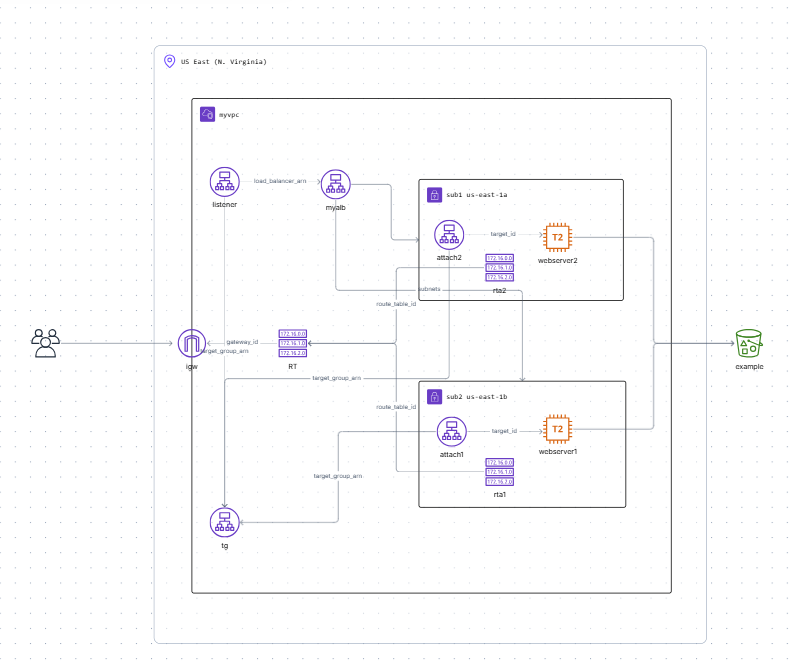

## Project Overview

The project illustrates:
- How to use Terraform to automate the creation of AWS resources.
- Key AWS components such as VPCs, subnets, security groups, EC2 instances, internet gateways, route tables, and an application load balancer.
- Best practices for using Terraform and scripting infrastructure as code (IaC).

This project includes the following architecture:



## Features
1. **AWS Infrastructure Components:**
   - Custom VPC with CIDR block.
   - Public subnets across multiple availability zones.
   - Internet Gateway for public subnet connectivity.
   - Route tables and subnet associations.
   - Security groups with custom inbound/outbound rules.
2. **EC2 Instances:**
   - Two EC2 instances with pre-configured Apache web servers.
   - User data scripts to initialize web servers.
3. **Application Load Balancer:**
   - Load balancing traffic between EC2 instances.
   - Target group configuration and health checks.
4. **S3 Integration:**
   - Example setup of an S3 bucket (optional enhancement).

## Prerequisites
- An AWS account.
- Terraform installed on your local machine.
- AWS CLI configured with appropriate IAM access.

## Usage Instructions
### 1. Clone the Repository
```bash
git clone <repository-url>
cd <repository-folder>
```

### 2. Initialize Terraform
Run the following command to initialize the working directory:
```bash
terraform init
```

### 3. Configure AWS Credentials
Ensure AWS CLI is configured with your access keys:
```bash
aws configure
```

### 4. Deploy the Infrastructure
Plan and apply the Terraform configuration:
```bash
terraform plan
terraform apply
```

### 5. Access Your Application
- Retrieve the load balancer's DNS name from the output of `terraform apply`.
- Open the DNS name in your browser to view the deployed web application.

### 6. Destroy the Infrastructure
To clean up and avoid unnecessary costs:
```bash
terraform destroy
```

## Folder Structure
```
.
├── main.tf                 # Main Terraform configuration file
├── variables.tf            # Variables for customizing the setup
├── user_data.sh            # User data script for EC2 instances
└── README.md               # Project documentation
```

## Resources Used
- **Terraform Documentation**: [https://registry.terraform.io/](https://registry.terraform.io/)
- **AWS CLI Documentation**: [https://aws.amazon.com/cli/](https://aws.amazon.com/cli/)
